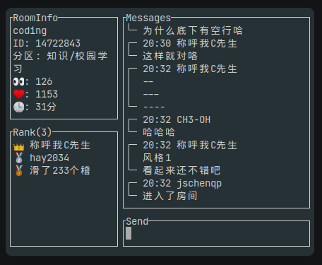
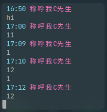

# bilibili 直播间 TUI

[关联的bilibili介绍视频](https://www.bilibili.com/video/bv1gG411G7XG)

风格1: 聊天室风格



风格2: 极简风格



项目文件:

```plaintext
  sender 发送弹幕的实现
  getter 获取弹幕的实现
  ui     TUI的实现
```

配置文件: config.toml 仓库内不带 请自己 从 config.toml.demo 复制修改

```plaintext
  Cookie: cookie信息 从web端找一个请求头复制cookie
  RoomId: 指定直播间roomId
  Theme: 1 or 2 // 定义主题，1 聊天室风格，2 极简风格
```

使用:

go run main.go -c config.toml

也可以从 参数定义 roomId, theme 优先级高于config

export LANG="en_US.utf-8"  
go run main.go -c config.toml -r 9527 -t 1

快捷键:

1. <esc> 退出
2. <ctrl+c> 退出
3. <ctrl+u> 清空输入内容
4. <up> 上一个输入记录
4. <down> 下一个输入记录
