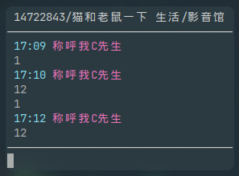
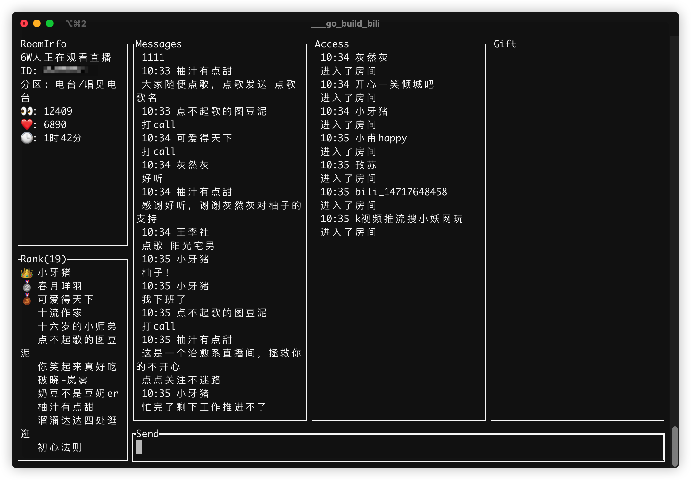

# bilibili 直播间 TUI

[关联的bilibili介绍视频](https://www.bilibili.com/video/bv1gG411G7XG)

使用方法 直接下载 releases 中的 bin文件即可

---

风格1: chatroom


风格2: pure


风格3: simple



风格4: info (感谢@soft98-top添加的theme4)



项目文件:

```plaintext
  sender 发送弹幕的实现
  getter 获取弹幕的实现
  ui     TUI的实现
```

配置文件: config.toml 仓库内不带 请自己 从 config.toml.demo 复制修改

```plaintext
  Cookie = "cookie信息 从web端找一个请求头复制cookie"
  RoomId = 指定直播间roomId
  Theme = 1                // 主题 1 2 3
  SingleLine = 1           // 是否开启单行
  ShowTime = 1             // 是否显示时间
  TimeColor = "#BBBBBB"    // 时间颜色
  NameColor = "#BBBBBB"    // 名字颜色
  ContentColor = "#BBBBBB" // 内容颜色
  FrameColor = "#BBBBBB"   // 边框颜色
  InfoColor = "#BBBBBB"    // 房间信息颜色
  RankColor = "#BBBBBB"    // 排行榜颜色
```

使用:

go run main.go -c config.toml

也可以从 参数定义 roomId, theme 优先级高于config(-r roomId, -t theme)

go run main.go -c config.toml -r 9527 -t 1

参数说明:  
  1. `-c string:configfile`
  2. `-r string:roomId`
  3. `-t int:theme`
  4. `-l int:singleline`
  5. `-s int:showtime`

快捷键:  
  1. \<esc> 退出
  2. <ctrl+c> 退出
  3. <ctrl+u> 清空输入内容
  4. <up> 上一个输入记录
  5. <down> 下一个输入记录

## 类似项目

[zaiic/bili-live-chat](https://github.com/zaiic/bili-live-chat): A bilibili streaming chat tool using TUI written in Rust. 

## 贡献者

- [yaocccc](https://github.com/yaocccc)  
- [soft98-top](https://github.com/soft98-top)
  - [PR#3 增加theme4，修复直播间rank显示](https://github.com/yaocccc/bilibili_live_tui/pull/3)  
- [zaiic](https://github.com/zaiic)
  - [PR#4 更新README，添加类似项目](https://github.com/yaocccc/bilibili_live_tui/pull/4)
